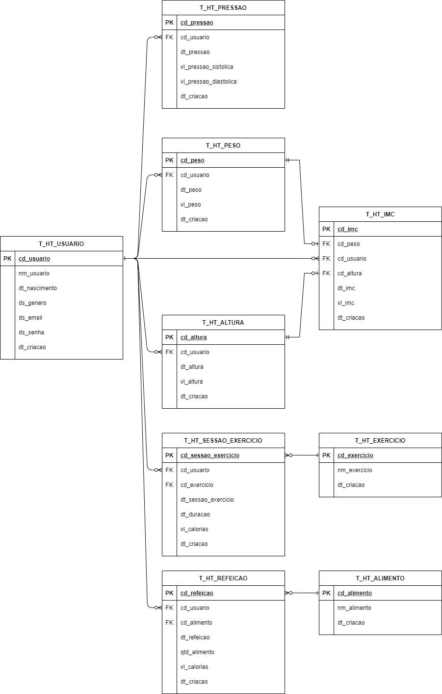

# HealthTrack

## Description

Almost vanilla java & Servlets.

### Stack

- No spring
- Only maven
- PostgreSQL
- OpenJDK 11
- Tomcat 9
- Servlets
- JSP
- JSTL
- WebJars

### Design Patterns

- Factory
- Singleton
- Data Access Object
- Model View Controller

### Features

- Template inheritance by custom tags at `src\main\webapp\WEB-INF\tags`
- Works on any machine that have docker installed

### Data Modeling



## Requirements

- Docker
- Docker Compose

## Usage

- **Run**:

```sh
docker-compose up && docker-compose run maven
```

- **Run tests**:

```sh
docker-compose run maven-test
```

- **Bring down with volumes**:

```sh
docker-compose down -v
```

- **Recompile war package and deploy to tomcat**:

```sh
docker-compose run maven
```

### If using Visual Studio Code as IDE

Checkout the tasks.json at .vscode

## Cover credits

- Man doing exercise - photo by <a href="https://unsplash.com/@lollish?utm_source=unsplash&utm_medium=referral&utm_content=creditCopyText">Lorenzo Fattò Offidani</a> on <a href="https://unsplash.com/?utm_source=unsplash&utm_medium=referral&utm_content=creditCopyText">Unsplash</a>
- Woman running on park - photo by <a href="https://unsplash.com/@hocza?utm_source=unsplash&utm_medium=referral&utm_content=creditCopyText">Jozsef Hocza</a> on <a href="https://unsplash.com/?utm_source=unsplash&utm_medium=referral&utm_content=creditCopyText">Unsplash</a>
