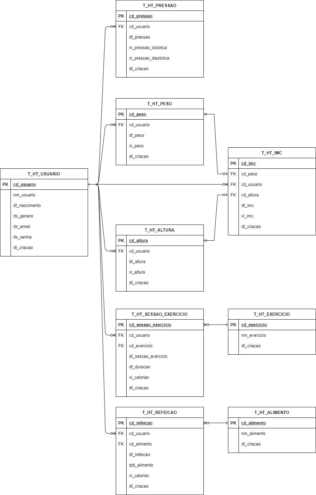

# HealthTrack

## Description

- No spring
- Only maven
- PostgreSQL
- OpenJDK 11
- Tomcat 9.0.54

### Data Modeling



## Requirements

- Docker
- Docker Compose

## Usage

- **Run**:

```sh
docker-compose up
```

- **Bring down with volumes**:

```sh
docker-compose down -v
```

- **Recompile war package and deploy to tomcat**:

```sh
docker-compose stop tomcat-server &&\
docker-compose build tomcat-server &&\
docker-compose up -d tomcat-server
```

## Cover credits

- Man doing exercise - photo by <a href="https://unsplash.com/@lollish?utm_source=unsplash&utm_medium=referral&utm_content=creditCopyText">Lorenzo Fattò Offidani</a> on <a href="https://unsplash.com/?utm_source=unsplash&utm_medium=referral&utm_content=creditCopyText">Unsplash</a>
- Woman running on park - photo by <a href="https://unsplash.com/@hocza?utm_source=unsplash&utm_medium=referral&utm_content=creditCopyText">Jozsef Hocza</a> on <a href="https://unsplash.com/?utm_source=unsplash&utm_medium=referral&utm_content=creditCopyText">Unsplash</a>
